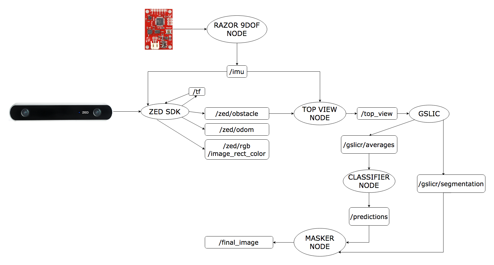

# Computer Vision
Overview of the subsystem:

Note: Ellipses correspond to ROS Nodes and Rectangles correspond to the corresponding topics.

##  Build and Working Status 
|Node|Build Status|Working Status|Credits|Future Work|
|----|------------|--------------|-------|-----------|
|birds_eye|||-|-|
|classifier|||[IGVC IITK](https://github.com/IGVC-IITK) (Built from scratch)|Improving training model for better accuracy|
|gSLICr/gslicr_ros|||[gSLICr](https://github.com/carlren/gSLICr)|Tuning Parameters|
|masker|||[IGVC IITK](https://github.com/IGVC-IITK) (Built from scratch)|-|
|top_view|||[IGVC IITK](https://github.com/IGVC-IITK) (Built from scratch)|-|
|zed-ros-wrapper|||[ZED ROS wrapper](https://github.com/stereolabs/zed-ros-wrapper)|-|

## classifier
This package contains the classifier_node and the launchfile for the full vision pipeline.
The classifier_node takes averaged image and uses pre-trained random forrest model to predict each superpixel as lane/not lane and publishes the prediction array to rostopic /predictions.
pipeline.launch is the launch file for the vision pipeline.
Sequentially executes the following ros nodes :

 * top_view
 * gslicr_ros
 * classifier
 * masker

## gslicr_ros
[gSLICr](https://github.com/carlren/gSLICr) is a GPU accelerated implementation of SLIC (Simple Linear Iterative Clustering) for real-time superpixel segmentation of images.

Modified for averaging of colors of pixels in each superpixel.

gslicr_ros is the ROS implementation of gSLICr. It subscribes to the top_view image and publishes

 * averaged rgb values of superpixels on the rostopic /gslicr/averages
 * superpixel id of each pixel on the rostopic /gslicr/segmentation

## masker
This package contains a node 'masker_node' that simply takes all the predictions from the classifer and all the superpixel id from gSLICr and masks the corresponding superpixels with the prediction values. It finally publishes the binary image on the rostopic /final_image.
