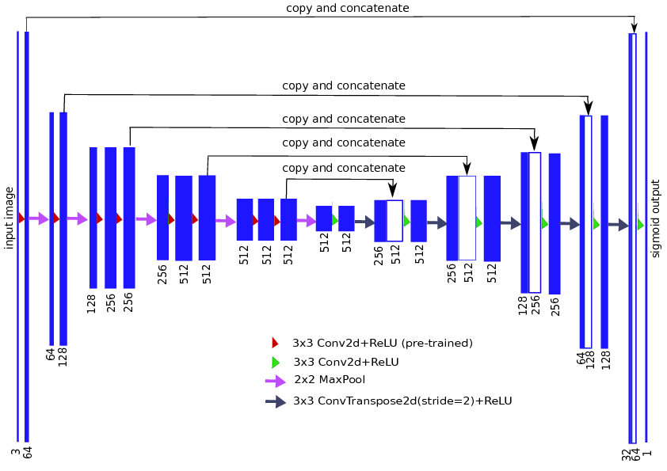
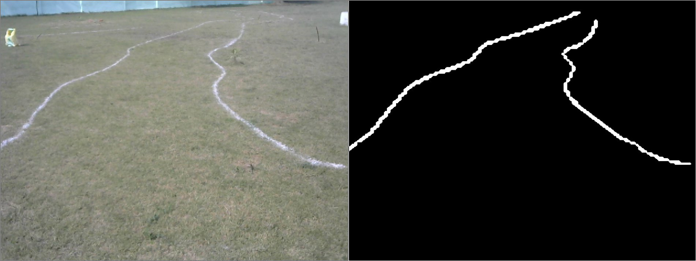

# U-Net
This is deep learning based pipeline for image segmentation to obtain a binary image clearly depicting the pixels which are a part of lane and which are now.
## Network architecture

This is a fully convolutional network which is trained on a dataset of `50` RGB images of size `128 X 128` which were augmented by random rotations and random flips.
## Predictions
The node `deep_classify.py` subscribes to an unwarped RGB image from the topic `\cv_camera\image_raw` and publishes an unwarped predicted image to topic `\binary_unwarped`. The following images show the output of the image for the given RGB image.

## Trained Model
You can find the trained model in the following link  
https://drive.google.com/file/d/1Dq680kaiv7DvDM4qOZNRaFvTbwFYEhHn/view
